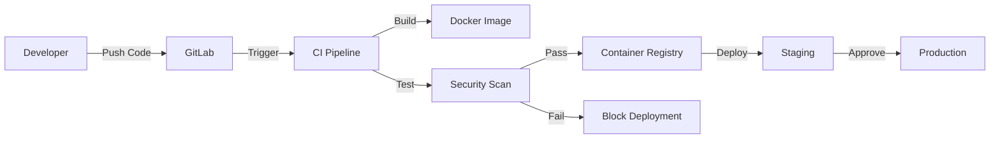

# Modul 07 - GitLab als CI/CD-Plattform

## Einführung

In modernen Unternehmen ist der Einsatz eines **CI/CD-Systems** (Continuous Integration / Continuous Deployment) unverzichtbar geworden. Diese Systeme bilden das Rückgrat der modernen Softwareentwicklung und DevOps-Praktiken.

## Warum ein CI/CD-System?

### Zentrale Anforderungen im Enterprise-Umfeld

**1. Container Image Repository**
- Zentrale Verwaltung und Speicherung aller Docker-Images
- Versionierung und Tagging von Images
- Zugriffskontrolle und Berechtigungsmanagement
- Scan auf Sicherheitslücken vor der Verwendung

**2. Package Repositories**
- Verwaltung von Dependency-Paketen (npm, pip, Maven, NuGet, etc.)
- Caching externer Pakete für Offline-Verfügbarkeit
- Sicherstellung konsistenter Paketversionen
- Schutz vor Supply-Chain-Angriffen

**3. On-Premise Einsatz**
- Vollständige Kontrolle über die Infrastruktur
- Keine Abhängigkeit von externen Cloud-Diensten
- Einhaltung von Compliance- und Datenschutzrichtlinien
- Betrieb in abgeschotteten Netzwerken (Air-Gapped)

### SecOps Integration

Moderne CI/CD-Plattformen integrieren **Security Operations (SecOps)** direkt in den Entwicklungsprozess:

**Security Features:**
- **Container Image Scanning**: Automatische Überprüfung auf bekannte Sicherheitslücken (CVEs)
- **Dependency Scanning**: Analyse von verwendeten Bibliotheken und Frameworks
- **Static Application Security Testing (SAST)**: Code-Analyse auf Sicherheitslücken
- **Dynamic Application Security Testing (DAST)**: Laufzeit-Tests der Anwendung
- **Secret Detection**: Erkennung von versehentlich committeten Passwörtern/Tokens
- **License Compliance**: Überprüfung von Lizenzkonformität
- **Vulnerability Management**: Zentrale Verwaltung und Priorisierung von Schwachstellen

**Compliance & Audit:**
- Nachvollziehbare Deployment-Historie
- Vier-Augen-Prinzip durch Approval-Workflows
- Audit-Logs für alle Änderungen
- Signierung von Images und Artefakten

## GitLab als All-in-One Lösung

GitLab Community Edition (CE) und Enterprise Edition (EE) bieten eine umfassende CI/CD-Plattform:

### Hauptkomponenten

**1. Source Code Management (SCM)**
- Git-Repository-Verwaltung
- Branch-Protection und Merge-Requests
- Code-Review-Workflows
- Wiki und Issue-Tracking

**2. Container Registry**
- Docker-Image-Registry integriert
- Multi-Level Image-Hierarchie
- Automatische Cleanup-Policies
- Integration mit Kubernetes

**3. Package Registry**
- npm (Node.js)
- PyPI (Python)
- Maven & Gradle (Java)
- NuGet (.NET)
- Composer (PHP)
- Conan (C/C++)
- Generic Package Registry

**4. CI/CD Pipelines**
- YAML-basierte Pipeline-Definition (.gitlab-ci.yml)
- Parallel und sequentielle Jobs
- Environments und Deployments
- Auto DevOps für standardisierte Workflows

**5. Security Dashboard**
- Zentrale Übersicht aller Sicherheitsfunde
- Vulnerability Reports
- Dependency Management
- License Compliance Übersicht

## Vorteile für Unternehmen

### Absicherung des On-Premise Betriebs

**Unabhängigkeit:**
- Keine Abhängigkeit von Docker Hub oder anderen Cloud-Registries
- Lokale Kopien aller benötigten Images
- Kontrollierte Update-Prozesse

**Netzwerksicherheit:**
- Keine ausgehenden Internet-Verbindungen erforderlich
- Betrieb in DMZ oder isolierten Netzwerken
- Verschlüsselte Kommunikation intern

**Performance:**
- Schnellere Pull-Zeiten durch lokale Registry
- Reduzierte Bandbreiten-Nutzung
- Keine Rate-Limits wie bei öffentlichen Registries

**Kontrolle:**
- Genehmigung vor Image-Verwendung
- Interne Quality-Gates
- Compliance mit Unternehmensrichtlinien

### Enterprise-Workflow Beispiel



**Prozessschritte:**
1. Developer pusht Code in GitLab
2. CI-Pipeline wird automatisch getriggert
3. Code wird kompiliert und getestet
4. Docker-Image wird gebaut
5. Security-Scans werden durchgeführt (SAST, Container Scan, Dependency Check)
6. Bei bestandenen Tests: Push in interne Container Registry
7. Automatisches Deployment in Staging-Umgebung
8. Nach manuellem Approval: Deployment in Production
9. Alle Schritte werden protokolliert (Audit-Trail)

## GitLab Deployment in diesem Modul

### Architektur

Das Docker Compose Setup in diesem Modul demonstriert:

```yaml
services:
  gitlab:
    image: gitlab/gitlab-ce:latest
    ports:
      - '80:80'       # Web-Interface
      - '443:443'     # HTTPS
      - '2222:22'     # SSH (Git)
      - '5050:5050'   # Container Registry
    volumes:
      - ./config:/etc/gitlab      # Konfiguration
      - ./logs:/var/log/gitlab    # Logs
      - ./data:/var/opt/gitlab    # Daten (Repos, Registry, etc.)
```

### Wichtige Konfigurationen

**Container Registry:**
```ruby
registry_external_url 'http://localhost:5050'
registry['enable'] = true
registry['registry_http_addr'] = "0.0.0.0:5050"
```

**External URL:**
```ruby
external_url 'http://192.168.101.127'
```

### Nach dem Start

1. **Initiales Root-Passwort abrufen:**
   ```bash
   docker exec -it gitlab grep 'Password:' /etc/gitlab/initial_root_password
   ```

2. **Login:**
   - URL: `http://<your-ip>`
   - User: `root`
   - Passwort: Aus Schritt 1

3. **Container Registry verwenden:**
   ```bash
   # Login in Registry
   docker login localhost:5050
   
   # Image taggen
   docker tag myapp:latest localhost:5050/mygroup/myapp:latest
   
   # Image pushen
   docker push localhost:5050/mygroup/myapp:latest
   ```

## Best Practices

### Security Hardening

1. **HTTPS aktivieren:**
   - Gültige SSL-Zertifikate verwenden
   - HTTP nur für lokale Entwicklung

2. **Zugriffskontrolle:**
   - LDAP/Active Directory Integration
   - Zwei-Faktor-Authentifizierung (2FA) erzwingen
   - Regelmäßige Access-Reviews

3. **Registry-Sicherheit:**
   - Image-Signing aktivieren
   - Regelmäßige Vulnerability-Scans
   - Alte/unused Images automatisch löschen

4. **Backup-Strategie:**
   - Regelmäßige Backups der Volumes
   - Disaster Recovery Plan
   - Backup-Tests durchführen

### Performance-Optimierung

1. **Resource Limits:**
   ```yaml
   deploy:
     resources:
       limits:
         cpus: '4'
         memory: 8G
       reservations:
         cpus: '2'
         memory: 4G
   ```

2. **Shared Runners:**
   - Dedizierte Runner-Pools für verschiedene Projekte
   - Autoscaling für Runner bei hoher Last

3. **Registry Storage:**
   - Objektspeicher (S3, MinIO) für große Image-Mengen
   - Garbage Collection regelmäßig durchführen

## Alternative Lösungen

Neben GitLab gibt es weitere Enterprise CI/CD-Lösungen:

| Lösung                | Stärken                                | Use Case                       |
| --------------------- | -------------------------------------- | ------------------------------ |
| **GitLab**            | All-in-One, SCM + CI/CD + Registry     | Kleine bis große Unternehmen   |
| **Jenkins**           | Sehr flexibel, große Plugin-Auswahl    | Custom CI/CD-Workflows         |
| **Azure DevOps**      | Microsoft-Integration, Cloud + On-Prem | Microsoft-Stack                |
| **GitHub Enterprise** | GitHub-Kompatibilität, Actions         | GitHub-basierte Workflows      |
| **Nexus Repository**  | Spezialisiert auf Artefakt-Management  | Multi-Format Repository        |
| **JFrog Artifactory** | Universal Artefakt-Repository          | Enterprise Artefakt-Management |
| **Harbor**            | Cloud Native Registry mit Replication  | Kubernetes-fokussiert          |

## Zusammenfassung

Ein zentrales CI/CD-System wie GitLab ist essentiell für:

✅ **Sicherheit**: SecOps-Integration, Vulnerability Scanning, Compliance  
✅ **Kontrolle**: On-Premise Betrieb, keine Cloud-Abhängigkeit  
✅ **Effizienz**: Automatisierte Pipelines, schnelle Deployments  
✅ **Qualität**: Code-Reviews, automatisierte Tests, Quality Gates  
✅ **Nachvollziehbarkeit**: Audit-Trails, Deployment-Historie  
✅ **Standardisierung**: Einheitliche Toolchain, Best Practices

Die Investition in eine solche Plattform zahlt sich durch erhöhte Entwicklungsgeschwindigkeit, bessere Codequalität und höhere Sicherheit schnell aus.

## Weiterführende Links

- [GitLab Documentation](https://docs.gitlab.com/)
- [GitLab Container Registry](https://docs.gitlab.com/ee/user/packages/container_registry/)
- [GitLab CI/CD](https://docs.gitlab.com/ee/ci/)
- [GitLab Security Features](https://docs.gitlab.com/ee/user/application_security/)
- [Docker Security Best Practices](https://docs.docker.com/engine/security/)
